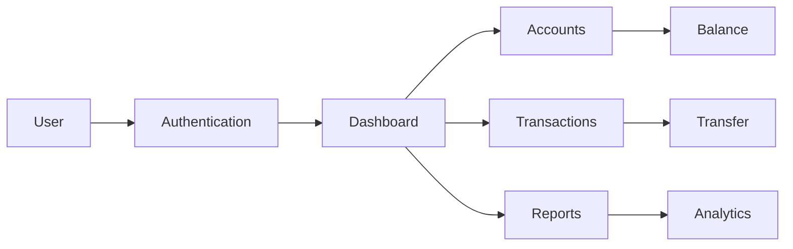
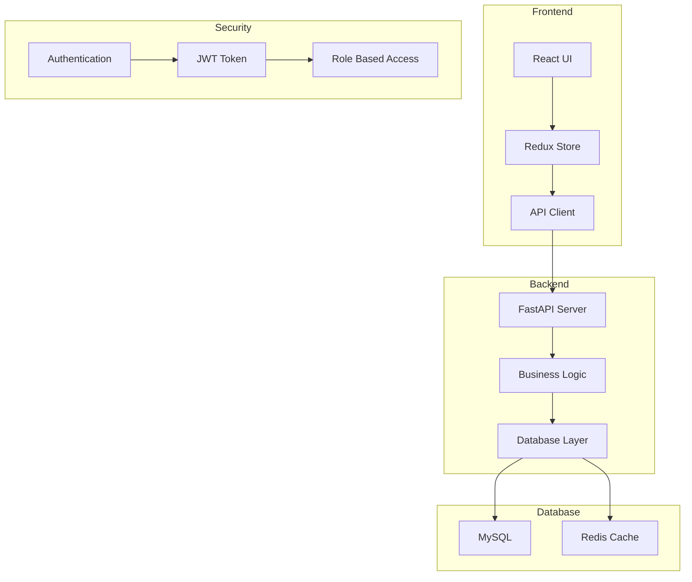
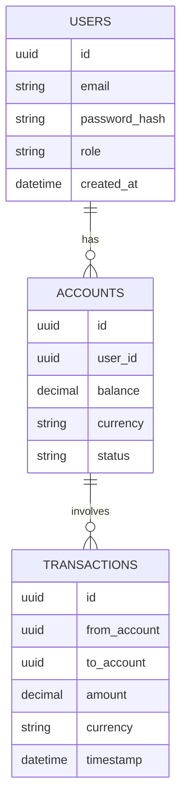

# 🏦 Banking Management System

<div align="center">

```
 ██╗  ██╗ ██████╗ ███████╗ █████╗ ██╗
 ██║ ██╔╝██╔═══██╗██╔════╝██╔══██╗██║
 █████╔╝ ██║   ██║███████╗███████║██║
 ██╔═██╗ ██║   ██║╚════██║██╔══██║██║
 ██║  ██╗╚██████╔╝███████║██║  ██║███████╗
 ╚═╝  ╚═╝ ╚═════╝ ╚══════╝╚═╝  ╚═╝╚══════╝
 ███████╗███████╗███╗   ██╗███████╗ ██████╗ ██╗  ██╗
 ██╔════╝██╔════╝████╗  ██║██╔════╝██╔═══██╗██║ ██╔╝
 ███████╗█████╗  ██╔██╗ ██║███████╗██║   ██║█████╔╝
 ╚════██║██╔══╝  ██║╚██╗██║╚════██║██║   ██║██╔═██╗
 ███████║███████╗██║ ╚████║███████║╚██████╔╝██║  ██╗
 ╚══════╝╚══════╝╚═╝  ╚═══╝╚══════╝ ╚═════╝ ╚═╝  ╚═╝
        🏦 Modern Banking System 🌟
```

[](https://git.io/typing-svg)

<div align="center">

</div>


[](LICENSE)
[](https://www.python.org)
[](https://fastapi.tiangolo.com)
[](https://tailwindcss.com)

<div align="center">

</div>

---

### 🌟 Modern Banking Made Simple

A cutting-edge banking management system that combines security, efficiency, and user experience.
Crafted with excellence by Kosal Sensok.

[📚 Features](#features) • [🎮 Demo](#demo) • [⚙️ Installation](#installation) • [📖 Documentation](#documentation) • [💡 Support](#support)


</div>

## 📊 Project Status Dashboard

<div align="center">

| Metric | Status |
|--------|--------|
| Build Status |  |
| Code Coverage |  |
| Last Commit |  |
| Issues |  |
| Pull Requests |  |

</div>

## 🎯 Core Features

<div align="center">

<table>
<tr>
<td align="center">

<br/>
<b>Account Management</b>
<br/>
<sub>• Create Accounts<br/>• View Balance<br/>• Account History</sub>
</td>
<td align="center">

<br/>
<b>Smart Transactions</b>
<br/>
<sub>• Instant Transfer<br/>• Scheduled Payments<br/>• Transaction Logs</sub>
</td>
<td align="center">

<br/>
<b>Enhanced Security</b>
<br/>
<sub>• 2FA Auth<br/>• Encryption<br/>• Fraud Detection</sub>
</td>
<td align="center">

<br/>
<b>Smart Dashboard</b>
<br/>
<sub>• Analytics<br/>• Reports<br/>• Insights</sub>
</td>
</tr>
</table>

</div>

## 🛠️ Tech Stack

<div align="center">

<table>
<tr>
<td align="center">

<br/>
<b>Backend</b>
<br/>
<sub>
• Python 3.8+<br/>
• FastAPI<br/>
• SQLAlchemy<br/>
• Redis
</sub>
</td>
<td align="center">

<br/>
<b>Frontend</b>
<br/>
<sub>
• React.js<br/>
• Tailwind CSS<br/>
• TypeScript<br/>
• Redux
</sub>
</td>
<td align="center">

<br/>
<b>Database</b>
<br/>
<sub>
• MySQL 8.0+<br/>
• Redis Cache<br/>
• Migrations<br/>
• Backups
</sub>
</td>
<td align="center">

<br/>
<b>DevOps</b>
<br/>
<sub>
• Docker<br/>
• GitHub Actions<br/>
• AWS<br/>
• Monitoring
</sub>
</td>
</tr>
</table>

</div>

## 🌟 Feature Highlights

<div align="center">



### Key Capabilities

| 🏦 Banking | 📊 Analytics | 🔒 Security | 📱 Interface |
|------------|-------------|-------------|--------------|
| Multi-Currency | Real-time Stats | Biometric Auth | Responsive UI |
| Auto-Payments | Smart Insights | Data Encryption | Dark Mode |
| Bill Splitting | PDF Reports | Fraud Detection | Notifications |
| Card Management | Tax Documents | Session Control | Accessibility |

</div>

## 🏗️ Project Architecture

<div align="center">



### System Components

| Layer | Technologies | Purpose |
|-------|-------------|----------|
| Frontend | React, Redux, TypeScript | User Interface & State Management |
| Backend | FastAPI, Python, SQLAlchemy | Business Logic & API Endpoints |
| Database | MySQL, Redis | Data Storage & Caching |
| Security | JWT, OAuth2, Argon2 | Authentication & Authorization |

</div>

## 💻 Implementation Details

<div align="center">

### Backend Structure

```
backend/
├── app/
│   ├── api/
│   │   ├── v1/
│   │   │   ├── auth.py
│   │   │   ├── users.py
│   │   │   ├── accounts.py
│   │   │   └── transactions.py
│   ├── core/
│   │   ├── config.py
│   │   ├── security.py
│   │   └── database.py
│   ├── models/
│   │   ├── user.py
│   │   ├── account.py
│   │   └── transaction.py
│   └── services/
│       ├── auth.py
│       ├── banking.py
│       └── notifications.py
```

### Frontend Structure

```
frontend/
├── src/
│   ├── components/
│   │   ├── common/
│   │   ├── auth/
│   │   └── banking/
│   ├── pages/
│   │   ├── dashboard/
│   │   ├── accounts/
│   │   └── transactions/
│   ├── store/
│   │   ├── actions/
│   │   └── reducers/
│   └── services/
│       ├── api.ts
│       └── auth.ts
```

</div>

## 📚 API Documentation

<div align="center">

### Authentication Endpoints

```typescript
// User Authentication
POST /api/v1/auth/login
POST /api/v1/auth/register
POST /api/v1/auth/refresh-token
POST /api/v1/auth/logout

// Response Example
{
    "access_token": "eyJhbGciOiJIUzI1NiIs...",
    "token_type": "bearer",
    "expires_in": 3600,
    "user": {
        "id": "uuid",
        "username": "user@example.com",
        "role": "user"
    }
}
```

### Banking Operations

```typescript
// Account Management
GET    /api/v1/accounts
POST   /api/v1/accounts
GET    /api/v1/accounts/{id}
DELETE /api/v1/accounts/{id}

// Transactions
POST   /api/v1/transactions/transfer
GET    /api/v1/transactions/history
GET    /api/v1/transactions/{id}

// Response Example
{
    "transaction_id": "uuid",
    "amount": 1000.00,
    "currency": "USD",
    "status": "completed",
    "timestamp": "2024-01-20T15:30:00Z"
}
```

</div>

## 🔧 Configuration Guide

<div align="center">

### Environment Variables

```bash
# Server Configuration
SERVER_HOST=0.0.0.0
SERVER_PORT=8000
DEBUG_MODE=False

# Database Configuration
DB_HOST=localhost
DB_PORT=3306
DB_NAME=banking_system
DB_USER=admin
DB_PASSWORD=secure_password

# Security
JWT_SECRET_KEY=your-secret-key
JWT_ALGORITHM=HS256
ACCESS_TOKEN_EXPIRE_MINUTES=30

# Redis Cache
REDIS_HOST=localhost
REDIS_PORT=6379
REDIS_DB=0
```

### Database Schema



</div>

## 🎥 Live Demo & Screenshots

<div align="center">

<table>
<tr>
<td width="50%">
<p align="center">

<br/>
<em>Secure Login Interface</em>
</p>
</td>
<td width="50%">
<p align="center">

<br/>
<em>Interactive Dashboard</em>
</p>
</td>
</tr>
</table>

</div>

## 🖼️ User Interface Screenshots

<div align="center">

### 🔐 Account Registration Screen


```
Features:
✓ Personal Information Collection
✓ Address Details
✓ Account Type Selection
✓ Initial Deposit Setup
✓ Currency Selection
```

### 💼 Account Management

<table>
<tr>
<td width="50%">

<p align="center"><em>Secure Login Interface</em></p>
</td>
<td width="50%">

<p align="center"><em>User Dashboard</em></p>
</td>
</tr>
</table>

### 🎨 Modern UI Elements

| Feature | Description |
|---------|-------------|
| 🌙 Dark Mode | Eye-friendly dark theme with professional color scheme |
| 📱 Responsive Design | Adapts seamlessly to different screen sizes |
| 🎯 Intuitive Navigation | Clear and user-friendly interface |
| 🔔 Real-time Notifications | Instant updates for account activities |

### 💫 Animations & Interactions

<table>
<tr>
<td width="33%">

<p align="center"><em>Transfer Process</em></p>
</td>
<td width="33%">

<p align="center"><em>Balance Updates</em></p>
</td>
<td width="33%">

<p align="center"><em>Alert System</em></p>
</td>
</tr>
</table>

### 📊 Transaction History


```
Features:
✓ Detailed Transaction Records
✓ Filter and Search
✓ Export Functionality
✓ Visual Transaction Analytics
```

</div>

## 🚀 Quick Start Guide

<div align="center">

<table>
<tr>
<td align="center">

<br/>

```bash
git clone https://github.com/KOSALSENSOK096/Banking-Management-System.rar.git
```
</td>
</tr>
<tr>
<td align="center">

<br/>

```bash
pip install -r requirements.txt
npm install
```
</td>
</tr>
<tr>
<td align="center">

<br/>

```bash
cp .env.example .env
# Update environment variables
```
</td>
</tr>
<tr>
<td align="center">

<br/>

```bash
python run.py
```
</td>
</tr>
</table>

</div>

## 🛠️ Development Setup

<div align="center">

### Prerequisites

```bash
# Required software
Python 3.8+
Node.js 14+
MySQL 8.0+
Redis 6+
```

### Environment Setup

```bash
# Create and activate virtual environment
python -m venv venv
source venv/bin/activate  # Linux/Mac
.\venv\Scripts\activate   # Windows

# Install dependencies
pip install -r requirements.txt
npm install

# Configure environment
cp .env.example .env
# Edit .env with your configurations
```

### Database Setup

```bash
# Create database
mysql -u root -p
CREATE DATABASE banking_system;

# Run migrations
python manage.py migrate
```

### Running the Application

```bash
# Start backend server
python manage.py runserver

# Start frontend development server
npm run dev
```

</div>

## 🤝 Contributing

<div align="center">

We welcome contributions! Here's how you can help:

1. 🍴 Fork the repository
2. 🌿 Create your feature branch (`git checkout -b feature/AmazingFeature`)
3. 💾 Commit your changes (`git commit -m 'Add some AmazingFeature'`)
4. 📤 Push to the branch (`git push origin feature/AmazingFeature`)
5. 🔄 Open a Pull Request

### Contribution Guidelines

- Write clean, maintainable code
- Follow the existing code style
- Add unit tests for new features
- Update documentation as needed
- Follow the [Code of Conduct](CODE_OF_CONDUCT.md)

</div>

## 📝 Code Style Guide

<div align="center">

We follow these coding standards:

```python
# Python: PEP 8
def calculate_interest(principal: float, rate: float, time: int) -> float:
    """
    Calculate simple interest.

    Args:
        principal (float): Principal amount
        rate (float): Interest rate (decimal)
        time (int): Time period in years

    Returns:
        float: Calculated interest amount
    """
    return principal * rate * time
```

```javascript
// JavaScript: ESLint + Prettier
const formatCurrency = (amount, currency = 'USD') => {
  return new Intl.NumberFormat('en-US', {
    style: 'currency',
    currency: currency
  }).format(amount);
};
```

</div>

## 🧪 Testing

<div align="center">

```bash
# Run Python tests
python -m pytest

# Run JavaScript tests
npm test

# Run e2e tests
npm run test:e2e
```

### Test Coverage Goals
- Backend: > 90%
- Frontend: > 85%
- E2E: Key user journeys

</div>

## 📦 Deployment

<div align="center">

```bash
# Build for production
npm run build

# Deploy using Docker
docker-compose up -d

# Monitor logs
docker-compose logs -f
```

### Supported Platforms
- ☁️ AWS
- 🌩️ Google Cloud
- 💻 Self-hosted
- 🐳 Docker

</div>