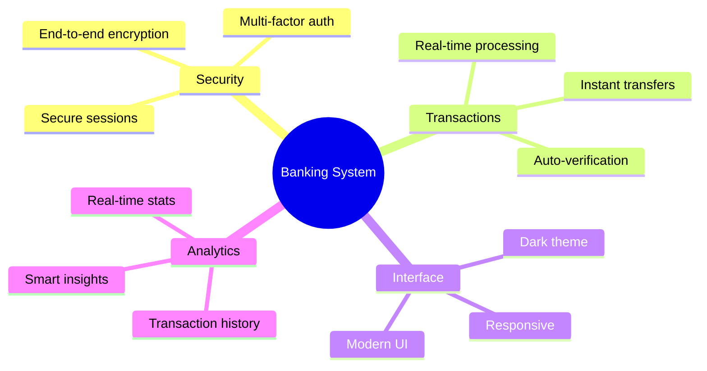

# 🏦 Banking Management System

<div align="center">

[](https://git.io/typing-svg)


[](LICENSE)
[](https://www.python.org)
[](https://fastapi.tiangolo.com)
[](https://tailwindcss.com)

---

### 🌟 Modern Banking Made Simple

A cutting-edge banking management system that combines security, efficiency, and user experience.

[📚 Features](#features) • [🎮 Demo](#demo) • [⚙️ Installation](#installation) • [📖 Documentation](#documentation) • [💡 Support](#support)


</div>

## ✨ Key Features

<div align="center">



| 🔐 Authentication | 💼 Banking | 🎨 User Interface | 🛡️ Security |
|------------------|------------|------------------|-------------|
| User Registration | Account Dashboard | Responsive Design | Password Hashing |
| Secure Login | Transaction History | Modern UI | JWT Authentication |
| Remember Me | Fund Transfers | Animations | Session Management |
| Password Protection | Balance Management | Notifications | XSS Protection |

</div>

## 🎥 Live Demo & Screenshots

<div align="center">

<table>
<tr>
<td width="50%">
<p align="center">

<br/>
<em>Secure Login Interface</em>
</p>
</td>
<td width="50%">
<p align="center">

<br/>
<em>Interactive Dashboard</em>
</p>
</td>
</tr>
</table>

</div>

## 🚀 Quick Start Guide

<div align="center">

<table>
<tr>
<td align="center">

<br/>

```bash
git clone https://github.com/KOSALSENSOK096/Banking-Management-System.rar.git
```
</td>
</tr>
<tr>
<td align="center">

<br/>

```bash
pip install -r requirements.txt
npm install
```
</td>
</tr>
<tr>
<td align="center">

<br/>

```bash
cp .env.example .env
# Update environment variables
```
</td>
</tr>
<tr>
<td align="center">

<br/>

```bash
python run.py
```
</td>
</tr>
</table>

</div>

## 🛠️ Technology Stack

<div align="center">

<table>
<tr>
<td align="center" width="25%">

<br/>HTML5
</td>
<td align="center" width="25%">

<br/>Python
</td>
<td align="center" width="25%">

<br/>MySQL
</td>
<td align="center" width="25%">

<br/>Git
</td>
</tr>
<tr>
<td align="center" width="25%">

<br/>CSS3
</td>
<td align="center" width="25%">

<br/>Node.js
</td>
<td align="center" width="25%">

<br/>Redis
</td>
<td align="center" width="25%">

<br/>Docker
</td>
</tr>
</table>

</div>

## 🔒 Security Features

<div align="center">

<table>
<tr>
<td align="center" width="25%">

<br/>
<b>Password Security</b>
<br/>
<sub>• Argon2 Hashing<br/>• Salt & Pepper<br/>• Password Policy</sub>
</td>
<td align="center" width="25%">

<br/>
<b>2FA Protection</b>
<br/>
<sub>• Time-based OTP<br/>• Email Verification<br/>• Backup Codes</sub>
</td>
<td align="center" width="25%">

<br/>
<b>Data Encryption</b>
<br/>
<sub>• AES-256<br/>• SSL/TLS<br/>• End-to-End</sub>
</td>
<td align="center" width="25%">

<br/>
<b>Access Control</b>
<br/>
<sub>• Role-based<br/>• IP Whitelisting<br/>• Rate Limiting</sub>
</td>
</tr>
</table>

</div>

## 📊 Project Statistics

<div align="center">

<table>
<tr>
<td>


</td>
<td>


</td>
</tr>
</table>

[](https://github.com/KOSALSENSOK096)

</div>

## 📱 Mobile View

<div align="center">

<table>
<tr>
<td width="33%">

<p align="center">Login Screen</p>
</td>
<td width="33%">

<p align="center">Dashboard</p>
</td>
<td width="33%">

<p align="center">Transfer Screen</p>
</td>
</tr>
</table>

</div>

## 🌐 Connect With Us

<div align="center">

[](mailto:your.email@gmail.com)
[](https://www.linkedin.com/in/your-profile)
[](https://github.com/KOSALSENSOK096)
[](https://twitter.com/your-handle)

</div>

---

<div align="center">

### 💝 Support & Feedback

[](https://www.buymeacoffee.com/your-username)
[](https://github.com/KOSALSENSOK096/Banking-Management-System.rar/issues)
[](https://github.com/KOSALSENSOK096/Banking-Management-System.rar/issues)


</div>