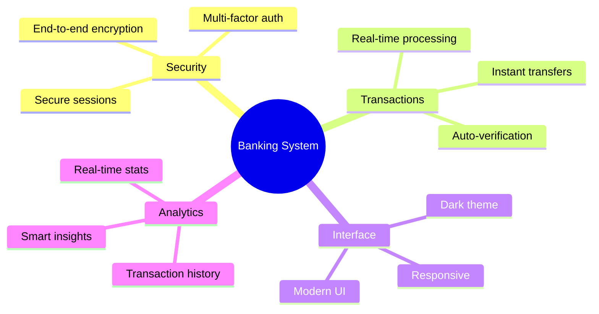
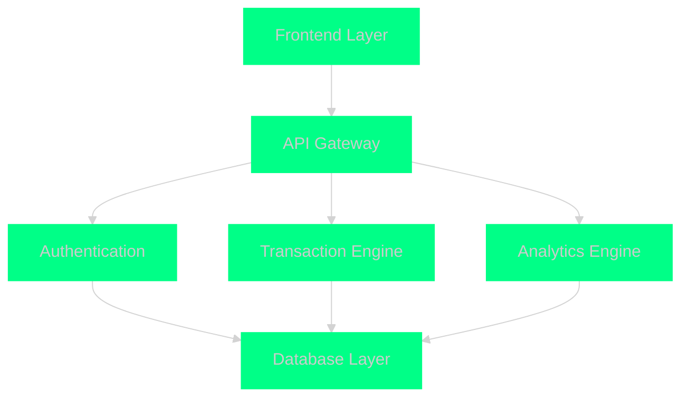

# Banking Management System 🏦

<div align="center">


[](https://git.io/typing-svg)

<p align="center">


</p>

<p align="center">


</p>

[](https://visitorbadge.io/status?path=KOSALSENSOK096%2FBanking-Management-System.rar)

<br/>


</div>

## 🌟 Overview

<div align="center">



</div>

## ⚡ Quick Links

<div align="center">

<a href="#documentation">
    
</a>
<a href="#demo">
    
</a>
<a href="#installation">
    
</a>
<a href="#contributing">
    
</a>

</div>

## 📊 Project Statistics

<div align="center">

<table>
<tr>
<td>

### 📈 Repository Stats


</td>
<td>

### 🔥 Contribution Streak


</td>
</tr>
</table>

</div>

## 🎯 Key Features

<div align="center">

<table>
<tr>
<td align="center" width="33%">

<br/>
<b>Modern Banking</b>
<br/>
<sub>• Real-time Transactions<br/>• Account Management<br/>• Balance Tracking</sub>
<br/><br/>

</td>
<td align="center" width="33%">

<br/>
<b>Advanced Security</b>
<br/>
<sub>• Biometric Auth<br/>• Encryption<br/>• Fraud Detection</sub>
<br/><br/>

</td>
<td align="center" width="33%">

<br/>
<b>Smart Dashboard</b>
<br/>
<sub>• Analytics<br/>• Reports<br/>• Insights</sub>
<br/><br/>

</td>
</tr>
</table>

</div>

## 💫 System Architecture

<div align="center">



</div>

## 🚀 Performance Metrics

<div align="center">

<table>
<tr>
<td align="center">

<br/><br/>

</td>
<td align="center">

<br/><br/>

</td>
<td align="center">

<br/><br/>

</td>
</tr>
</table>

</div>

## 📱 Interface Preview

<div align="center">

<table>
<tr>
<td width="33%">

<p align="center">Secure Login</p>
</td>
<td width="33%">

<p align="center">Smart Dashboard</p>
</td>
<td width="33%">

<p align="center">Quick Transfer</p>
</td>
</tr>
</table>

</div>

## 🌐 Connect With Us

<div align="center">

<a href="mailto:your.email@gmail.com">
    
</a>
<a href="https://www.linkedin.com/in/your-profile/">
    
</a>
<a href="https://github.com/KOSALSENSOK096">
    
</a>
<a href="https://twitter.com/your-handle">
    
</a>

</div>

## 📦 Installation

```bash
# Clone the repository
git clone https://github.com/KOSALSENSOK096/Banking-Management-System.rar.git

# Navigate to project directory
cd Banking-Management-System

# Install dependencies
pip install -r requirements.txt

# Run the application
python main.py
```

## 💖 Support & Feedback

<div align="center">

<a href="https://www.buymeacoffee.com/your-username">
    
</a>
<a href="https://github.com/KOSALSENSOK096/Banking-Management-System.rar/issues">
    
</a>
<a href="https://github.com/KOSALSENSOK096/Banking-Management-System.rar/discussions">
    
</a>

<br/>
<br/>


</div>